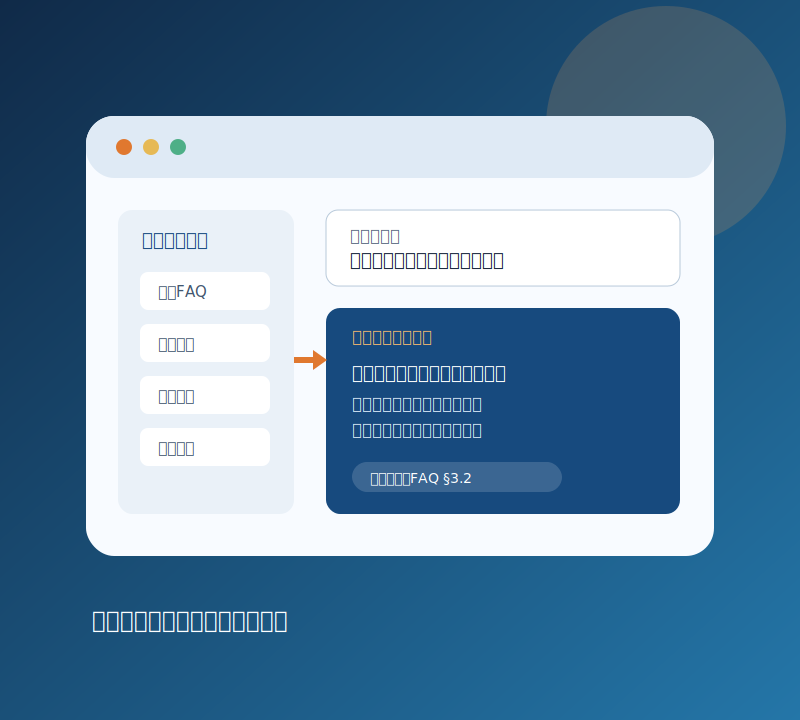
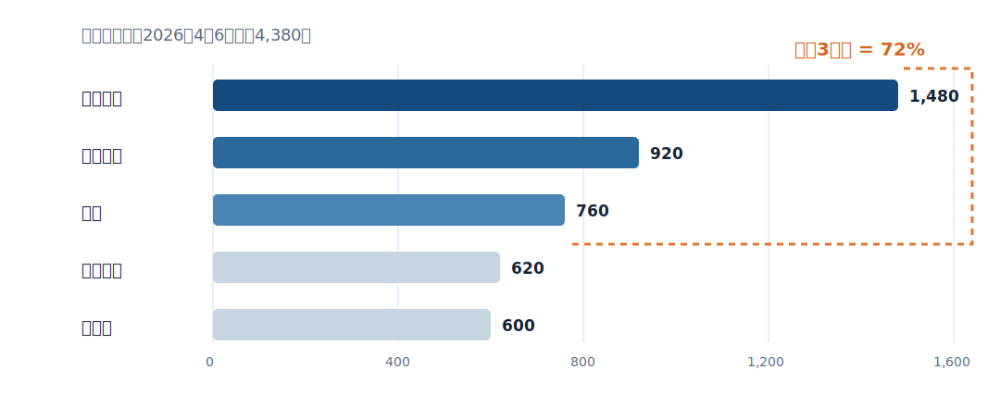

<!-- _class: cover -->
<!-- _paginate: false -->

# Component gallery

## 内容に必要な表現だけを選ぶ

---

<!-- _class: split -->

# Split imageは、主張と具体像を対応させる

- 左側にaction titleと短い説明
- 右側に意味のあるローカル画像
- 画像のaltは読み取る要点を書く



---

<!-- _class: chart -->

# Assertion + chartは、タイトルを結論にする



---

# Matrixは、同じ評価軸で選択肢を比べる

| 選択肢 | 効果検証 | 初期費用 | 運用リスク |
|---|---:|---:|---|
| 現状維持 | 低 | 低 | 高 |
| 限定PoC | **高** | 中 | 低 |
| 全面導入 | 中 | 高 | 高 |

---

<!-- _class: quote -->

# Quoteは、証言を主張の根拠へ接続する

> 「検索先が5つあり、回答を書く時間より探す時間の方が長い」

— サポート担当者インタビュー、2026-06-18

---

<!-- _class: exercise -->

# 演習：次の観測を1つ選ぶ

```text
10:02 deploy v2.8.0 completed
10:05 checkout API p95 latency 4.2s
10:06 search API p95 latency 180ms
```

仮説、確認項目、結果による次の分岐を90秒で書く。

---

<!-- _class: closing -->

# Galleryは部品表であり、ページ列のテンプレートではない

visual briefに合う表現だけを使い、同じ構図を機械的に繰り返さない。
