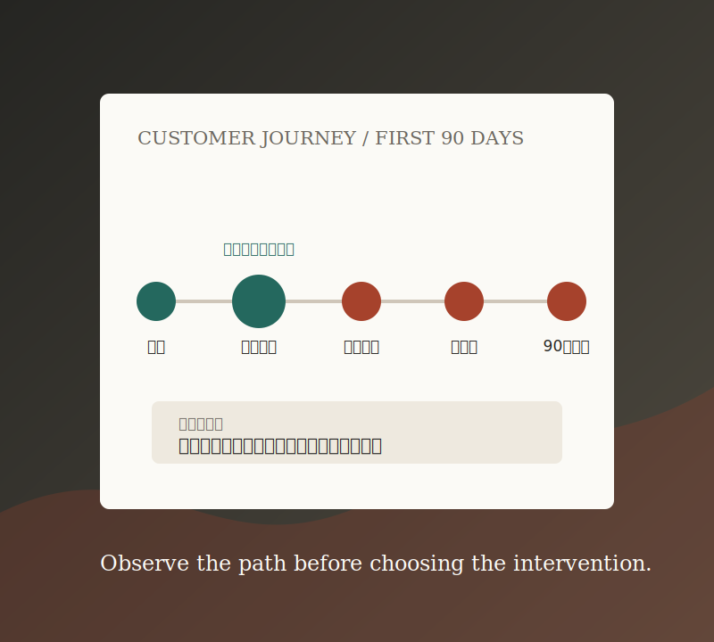
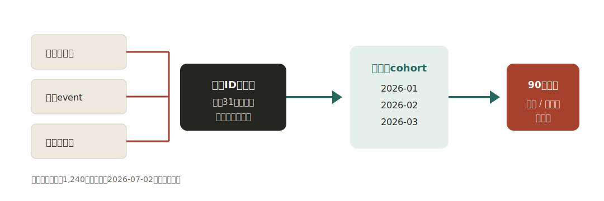
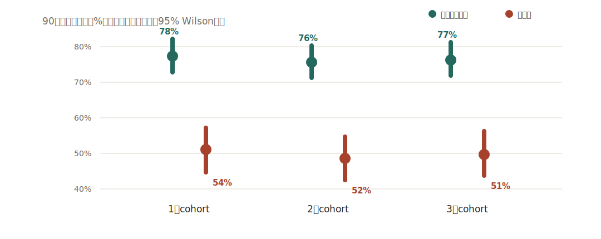
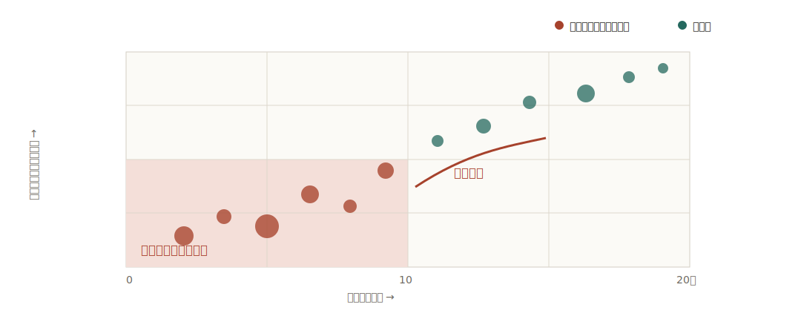
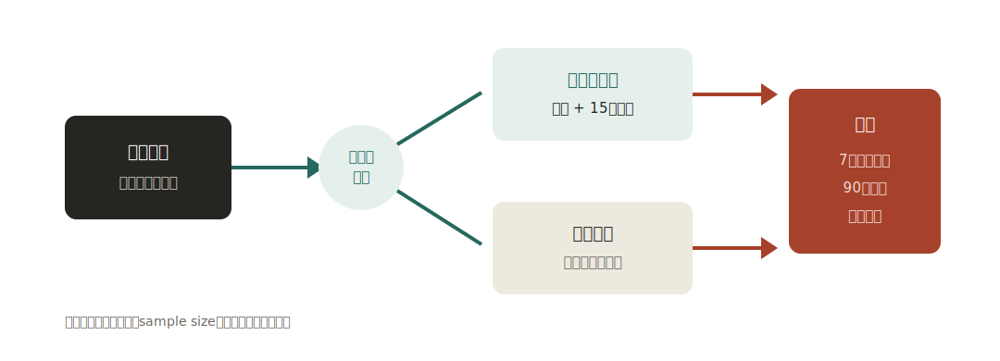

<!-- _class: cover split contain-visual -->
<!-- _paginate: false -->

# 解約差は価格より、初週設定の完了有無と強く関連していた

## 2026年第2四半期 解約分析

---

<!-- _class: diagram dense compact-visual -->

# 1,240社を契約月で揃え、初週設定と90日継続の関連を比較した

対象：2026年1〜3月の新規契約1,240社（試用除外） ／ 設定event欠損31社は主分析から分離
出典：デモ顧客データ辞書 v2026-06、抽出日 2026-07-02

---

<!-- _class: chart compact-visual -->

# 初週設定完了群は、全cohortで90日継続率が22〜27pt高い

注：観察データの関連であり、設定完了の因果効果を直接示さない。95% Wilson区間を表示。

---

<!-- _class: chart compact-visual -->

# 価格を退会理由に挙げた企業でも、低利用群では設定未完了が集中した

読み取り：価格認識と導入停滞は併存する。値引き単独での改善を示す結果ではない。

---

# 事実と解釈を分けると、改善仮説は「最初の7日」に絞られる

| 層 | この分析から言えること | まだ言えないこと |
|---|---|---|
| 事実 | 初週設定完了群の継続率が高い | 設定完了が継続を生む |
| 解釈 | 初期導入の停滞が早期離脱のsignal | 価格が無関係である |
| 仮説 | 7日以内の支援で設定完了が増える | 施策の費用対効果 |

> 判断境界：支持するのは初週支援の**検証優先度**まで。施策効果と投資対効果は未検証。

---

<!-- _class: dense -->

# 結論の一般化には、選択bias・計測誤差・90日追跡の限界がある

| 限界 | 影響 | 次の対処 |
|---|---|---|
| 自走できる顧客ほど設定を完了 | 効果を過大評価する可能性 | 無作為化した支援実験 |
| event欠損31社 | 完了率の誤分類 | server logとの突合 |
| 90日追跡のみ | 長期継続を説明できない | 180日指標を継続観測 |
| 価格回答は自己申告 | 理由の単純化 | 面談sampleで補完 |

> 解釈上の上限：3つの限界が残るため、現時点では関連の再現性を示せても因果効果は断定できない。

---

<!-- _class: diagram compact-visual -->

# 次四半期は、初週支援の無作為化実験で因果効果を切り分ける

主要評価：7日設定完了率 ／ 副次評価：90日継続率、支援工数

---

<!-- _class: closing -->

# 現時点の結論は「値引き」ではなく「初週支援を検証する価値がある」までである

因果効果、長期継続、費用対効果は次の実験で更新する。
