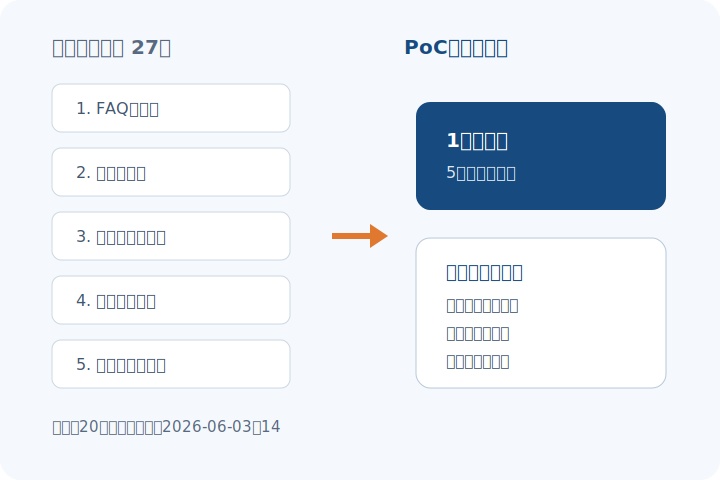
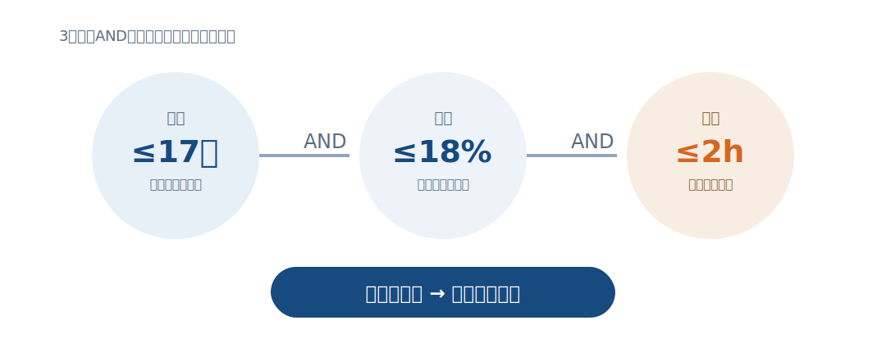
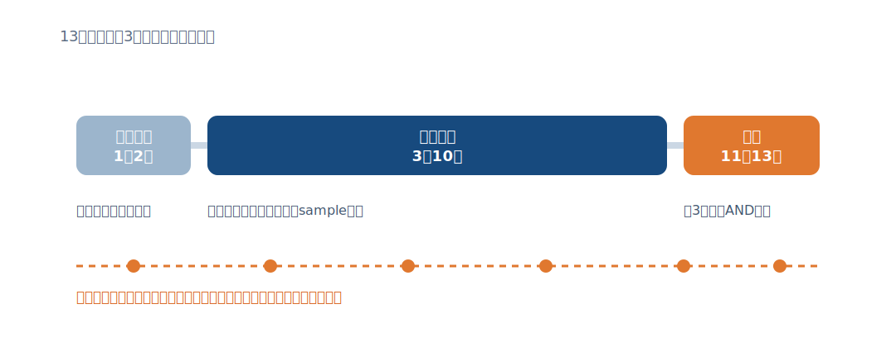

<!-- _class: cover split contain-visual -->
<!-- _paginate: false -->

# 300万円の限定PoCで、探索時間を減らせるか検証する

## 問い合わせ支援 — 投資判断

<!--
本日の判断は全面導入ではありません。90日で効果と運用負荷を測る限定PoCの可否です。
-->

---

# 本日承認いただきたいのは、予算300万円と対象3分類である

| 判断項目 | 推奨 | 境界条件 |
|---|---|---|
| 対象 | 配送確認・契約変更・請求 | 個人情報を含む回答は対象外 |
| 期間 | 90日 | 最初の2週は基準測定 |
| 予算 | 300万円上限 | 追加開発は再承認 |
| 本導入判定 | 時間・品質・運用負荷 | 3指標すべてを満たす |

> 成功しても自動応答へは進まず、担当者支援の有効性だけを判定する。

<!--
判断境界を先に合意し、PoC中のスコープ拡大を防ぎます。
-->

---

<!-- _class: chart -->

# 上位3分類が問い合わせの72%を占め、限定PoCでも十分な母数がある

<!--
2026年4〜6月の月平均です。分類は受付時の主分類を使い、重複計上はありません。
-->

---

<!-- _class: split -->

# 回答34分のうち27分は、5情報源を横断する探索時間である

- 観測：探索 27分、回答作成 7分
- 解釈：生成そのものより、根拠候補の検索が改善余地
- PoC：引用元を残す検索支援に限定

<!--
時間は20件の業務観察の中央値です。速度だけでなく引用の妥当性も測ります。
-->

---

# 限定PoCは、現状維持や全面導入より検証可能性が高い

| 選択肢 | 学習量 | 初期費用 | 誤回答リスク | 90日後の撤退性 |
|---|---:|---:|---:|---:|
| 現状維持 | 低 | 0 | 現状同等 | 高 |
| **限定PoC** | **高** | **300万円** | **人が確認** | **高** |
| 全面導入 | 中 | 1,800万円〜* | 自動化範囲次第 | 低 |

\* 仮説レンジ。正式見積ではなく、比較のための初期想定。

<!--
全面導入費は未確認です。ここで承認を求める数字ではないため、仮説レンジと明示しています。
-->

---

<!-- _class: chart -->

# 本導入は「50%短縮」だけでなく、品質と週次運用負荷を同時に満たして決める

<!--
速度が改善しても品質が悪化すれば不採用です。開始前にこのゲートを固定します。
-->

---

<!-- _class: diagram -->

# 90日を「基準測定→限定運用→判定」の3区間に分け、途中で品質停止線を置く

<!--
重大な誤引用が1件でも確認された場合は一時停止し、原因分析後に再開可否を判断します。
-->

---

<!-- _class: closing -->

# 限定PoCなら、300万円で効果と運用リスクの両方を判断できる

本日：予算上限、対象3分類、90日後の判定会を承認

<!--
承認後5営業日以内に、対象部門と計測定義を確定します。
-->
