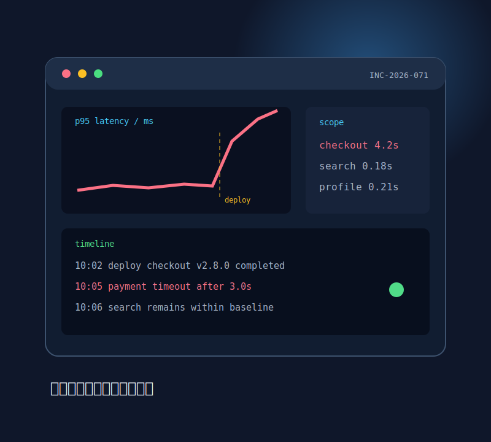
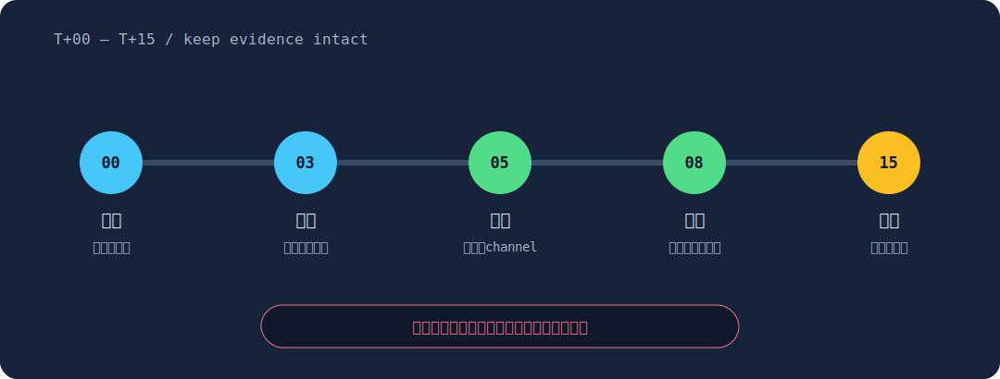
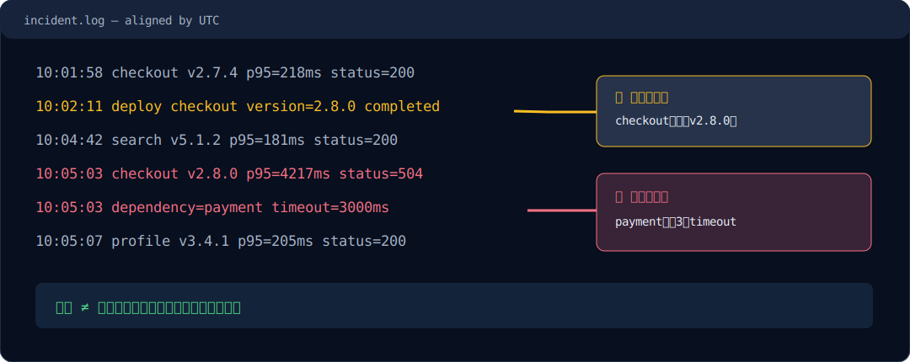
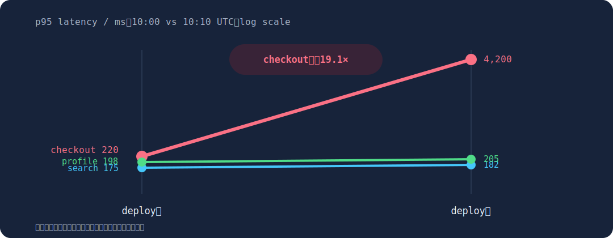
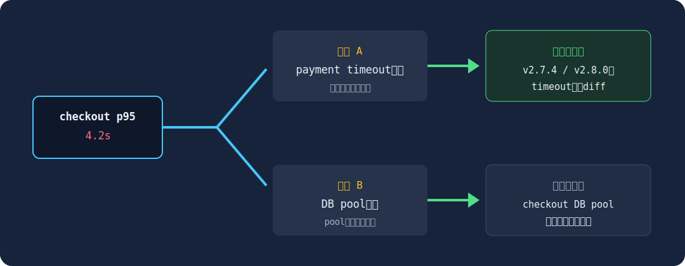

<!-- _class: cover split contain-visual -->
<!-- _paginate: false -->

# 最初の15分を「観測→仮説→最小検証」で再現可能にする

## 新人SRE向け incident response



<!--
今日は原因を当てる訓練ではなく、次の確認を選ぶ訓練です。
-->

---

# 20分後には、事実と推測を分けて次の1手を説明できる

1. 症状の時刻・範囲・期待値を固定する
2. 変更履歴と依存関係から仮説を2つまで立てる
3. 片方を否定できる最小の確認を選ぶ

> 成功条件：演習で「仮説、確認、結果による分岐」を90秒以内に書ける。

<!--
ツールの操作手順より、思考の順序を持ち帰ってください。
-->

---

<!-- _class: diagram -->

# 初動は、復旧作業の前に影響範囲と時間軸を固定する



<!--
安全上必要な緊急操作を除き、証拠を消す変更は避けます。
-->

---

<!-- _class: screenshot -->

# エラー行だけでなく、直前の変更と依存先を時系列で比べる



観測：checkoutのみ悪化 ／ 仮説：v2.8.0のpayment timeout設定

<!--
この時点ではdeployとの時間的関連だけで、原因確定ではありません。
-->

---

<!-- _class: chart -->

# p95悪化はcheckoutだけで、全体的な計算資源不足とは整合しない



出典：training fixture `service-metrics.csv`、10:00〜10:10 UTC

<!--
対数尺度なので、線の傾きだけで差を読まず、必ず併記した実値を確認します。
-->

---

<!-- _class: diagram -->

# 最小検証は、payment呼び出しを旧版と比較して仮説を1つ落とす



<!--
複数設定を一度に変えると、どの仮説が正しかったか分からなくなります。
-->

---

<!-- _class: exercise -->

# 演習：次に確認する1項目を選ぶ

```text
10:02 deploy checkout v2.8.0 completed
10:05 checkout p95=4200ms / 504=7.8%
10:05 search p95=180ms / 5xx=0.1%
10:06 payment dependency timeout=3.0s
```

回答形式：`仮説 / 確認項目 / Aなら次へ / Bなら次へ`

<!--
90秒。復旧操作ではなく、まず確認を1つだけ選んでください。
-->

---

<!-- _class: closing -->

# 持ち帰る順序は、観測 → 仮説 → 最小検証

原因候補を狭めてから変更し、各操作と結果を同じ時系列へ残す。

<!--
演習の推奨回答は、旧版と新版のpayment呼び出しtimeout値を比較する、です。
-->
